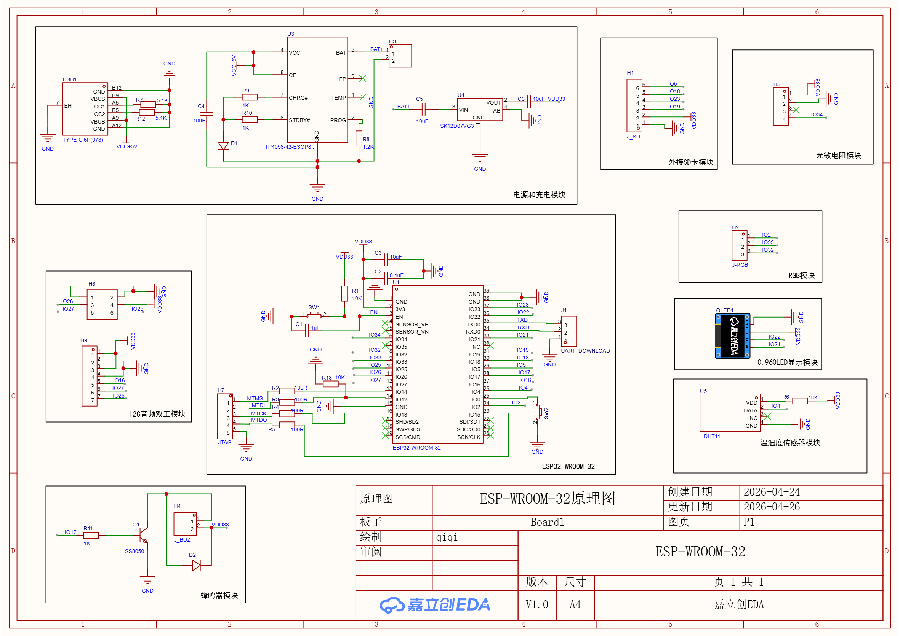
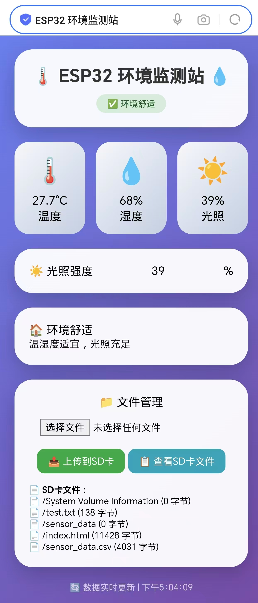

# 🌡️ ESP32 智能环境监测系统

[](https://platformio.org/)
[](LICENSE)

## 📖 项目简介

基于ESP32的温湿度、光照监测系统。数据实时显示在OLED屏幕上，同时保存到SD卡，并支持手机/电脑浏览器查看。

**功能：**
- 🌡️ 温湿度采集（DHT11）
- ☀️ 光照采集（光敏电阻）
- 🖥️ OLED本地显示
- 💾 SD卡数据存储（CSV格式）
- 🌐 Web远程查看

## 🛠️ 硬件清单

| 器件 | 型号 |
|------|------|
| 主控 | ESP32 |
| 温湿度传感器 | DHT11 |
| 光照传感器 | 光敏电阻模块 |
| 显示屏 | 0.96寸 OLED |
| 存储模块 | MicroSD卡模块 |

## 🔌 硬件连接

| 外设 | ESP32引脚 |
|------|-----------|
| DHT11 | GPIO4 |
| 光敏电阻 | GPIO34 |
| OLED(SDA) | GPIO21 |
| OLED(SCL) | GPIO22 |
| SD卡(CS) | GPIO5 |
| SD卡(MOSI) | GPIO23 |
| SD卡(MISO) | GPIO19 |
| SD卡(SCK) | GPIO18 |

## 📷 图片

| 原理图 | 实物图 | 手机网页 |
|:---:|:---:|:---:|
|  |  |  |

## 🚀 快速开始 (Getting Started)

### 1️⃣ 环境准备
- 安装 [VS Code](https://code.visualstudio.com/)
- 安装 [PlatformIO IDE](https://platformio.org/) 插件

### 2️⃣ 克隆项目
```bash
git clone https://github.com/qiqi957/ESP32-Environmental-Monitor.git
```

## 🙏寻求指导与交流

🧑‍🎓我是嵌入式初学者，这个项目是我学习过程中的一次尝试。由于水平有限，代码和硬件设计中可能存在以下不足：

- 代码规范可能有待改进
- 可能存在潜在bug或稳定性问题
- PCB设计经验不足，可能有优化空间

**如果您有任何建议、批评或改进思路，都非常欢迎告诉我！**

- 发现Bug → 请提 [Issue](https://github.com/qiqi957/ESP32-Environmental-Monitor/issues)
- 有改进想法 → 欢迎 Fork 并提交 Pull Request
- 想交流学习 → 可以发邮件2975972435@qq.com给我

感谢每一位愿意花时间指导新手的前辈！🙏
