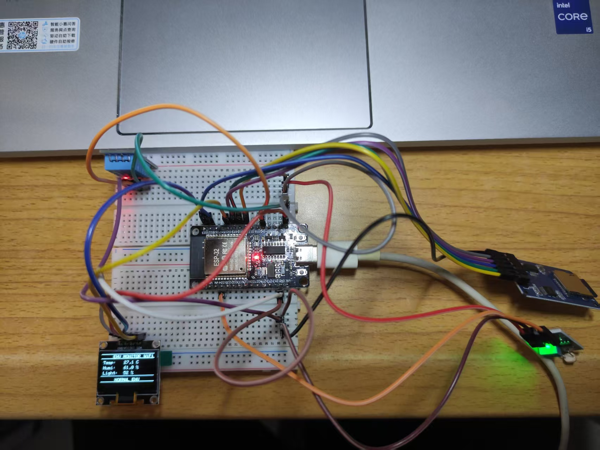

<br>
<div align="center">
  <!-- 这里可以放一个项目LOGO，没有就删掉这行 -->
  
  <h1>🌡️ ESP32 环境监测系统</h1>
  <p>
    <strong>基于ESP32的温湿度、光照监测系统 | 本地显示 | Web监控 | SD卡存储</strong>
  </p>
  <p>
    
    
    
  </p>
  <!-- 这里放你的硬件照片，让项目看起来更直观 -->
  
</div>

---

## 📖 项目简介

这是一个基于 **ESP32** 的物联网环境监测系统。它能实时采集温湿度(DHT11)和光照强度(光敏电阻)，并在 **OLED屏幕** 上本地显示，同时数据会存入 **SD卡** 进行持久化存储。此外，ESP32 会创建一个 **Web 服务器**，用户可通过同一 Wi-Fi 下的手机或电脑浏览器，随时查看最新数据。

**开发周期**：2周 ｜ **代码量**：400+行 ｜ **状态**：✅ 已完成

---

## ✨ 核心功能

| 功能模块 | 实现方式 | 亮点 |
| :--- | :--- | :--- |
| **环境感知** | DHT11 (温湿度) + 光敏电阻 (光照) | 非阻塞编程，传感器读取稳定 |
| **本地显示** | 0.96寸 OLED (I2C协议) | 实时刷新，界面简洁 |
| **远程监控** | 轻量级 Web 服务器 + JSON API | 适配手机/电脑，无需额外App |
| **数据存储** | SD卡 (SPI协议) + CSV格式 | 长期记录，可导出Excel分析 |

---

## 🛠️ 硬件清单

| 器件名称 | 型号 | 数量 | 作用 |
| :--- | :--- | :--- | :--- |
| 主控 | ESP32 | 1 | 核心控制与通信 |
| 温湿度传感器 | DHT11 | 1 | 采集环境温湿度 |
| 光照传感器 | 光敏电阻模块 | 1 | 采集环境光照强度 |
| 显示屏 | 0.96寸 OLED | 1 | 本地数据显示 |
| 存储模块 | MicroSD卡模块 | 1 | 数据持久化存储 |
| 辅助 | 400孔面包板 + 杜邦线 | 1套 | 电路搭建 |

---

## 🔌 硬件连接

| 外设 | ESP32 引脚 |
| :--- | :--- |
| DHT11 数据 | GPIO4 |
| 光敏电阻 AO | GPIO34 |
| OLED (SDA) | GPIO21 |
| OLED (SCL) | GPIO22 |
| SD卡 (CS) | GPIO5 |
| SD卡 (MOSI) | GPIO23 |
| SD卡 (MISO) | GPIO19 |
| SD卡 (SCK) | GPIO18 |

---

## 🚀 快速开始 (Getting Started)

### 1️⃣ 环境准备
- 安装 [VS Code](https://code.visualstudio.com/)
- 安装 [PlatformIO IDE](https://platformio.org/) 插件

### 2️⃣ 克隆项目
```bash
git clone https://github.com/qiqi957/ESP32-Environmental-Monitor.git


## 🙏 寻求指导与交流

> 🧑‍🎓 我是嵌入式初学者，这个项目是我学习过程中的一次尝试。由于水平有限，代码和硬件设计中可能存在以下不足：
>
> - 代码规范可能有待改进
> - 可能存在潜在bug或稳定性问题
> - PCB设计经验不足，可能有优化空间
>
> **如果您有任何建议、批评或改进思路，都非常欢迎告诉我！**
>
> - 发现Bug → 请提 [Issue](https://github.com/你的用户名/ESP32-Environmental-Monitor/issues)
> - 有改进想法 → 欢迎 Fork 并提交 Pull Request
> - 想交流学习 → 可以发邮件给我
>
> 感谢每一位愿意花时间指导新手的前辈！🙏
